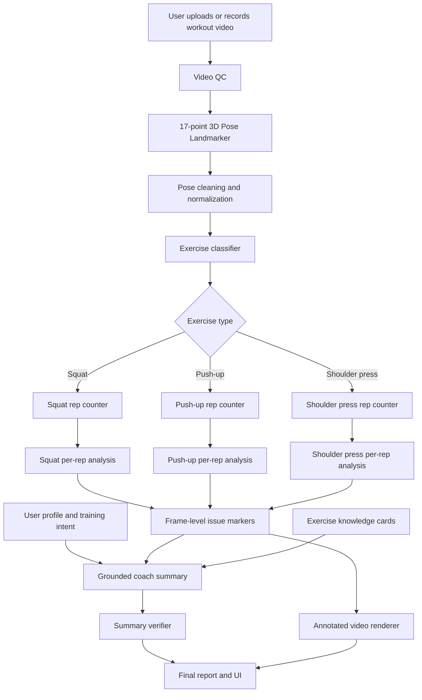
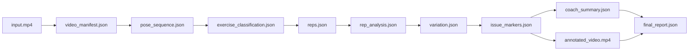

# Pozify Project Documentation

## 1. Product Overview

**Pozify** is a Gradio web app that lets a user upload or record a short workout video, then returns a rep-by-rep movement report built from pose landmarks, movement metrics, frame-level issue markers, and goal-aware coaching feedback.

One-line pitch:

> Pozify turns a short workout video into a rep-by-rep movement report: what you did, where your form changed, why it matters for your goal, and what to practice next.

Pozify is not positioned as a generic fitness chatbot. It is a **video evidence review cockpit**: the user sees the exercise detected, rep count, issue timestamps, movement metrics, confidence notes, and a practical next-session plan.

Pozify is also not a medical or clinical product. It should not diagnose injuries, claim to prevent injuries, or replace a qualified trainer, clinician, or physical therapist.

## 2. MVP Scope

The MVP supports three exercises:

- Squat.
- Push-up.
- Shoulder press.

Depth strategy:

- Classify all three supported exercises.
- Provide deeper analysis for squat and push-up first.
- Provide shoulder press counting and one or two core issue checks in the MVP.
- Clearly display confidence and feature depth in the UI.

### In Scope

- Gradio web app.
- Upload or record short workout videos.
- User profile and training intent form.
- Video quality check.
- 17-point 3D pose extraction.
- Pose cleaning and normalization.
- Exercise classifier for `squat`, `push_up`, `shoulder_press`, and `unknown`.
- Exercise-specific rep counter.
- Per-rep movement metrics.
- Basic variation detection.
- Frame-level issue markers.
- Annotated video renderer.
- Grounded coach summary from a small language model.
- Verifier for coach summary quality and safety.
- JSON evidence/debug output.
- Optional downloadable JSON/PDF report.

### Out Of Scope

- Medical diagnosis.
- Injury claims.
- Lab-grade biomechanics claims.
- Support for every gym exercise.
- Real-time live coaching.
- Multi-person workout analysis.
- Replacing a professional coach or clinician.

## 3. Target User And Problem

Target users:

- Beginner or casual gym-goers.
- People training at home.
- Users who already record workout videos but do not know how to evaluate them.
- Users who need specific, timestamped feedback instead of generic advice.

Core user problem:

- The user has a video but does not know which reps changed or failed.
- Online form advice is often generic and not tied to visible evidence.
- Valid exercise variations can be mistaken for errors.
- Beginners need concise cues and a concrete next action.

## 4. System Architecture

Main pipeline:

```text
user profile + input video
-> video QC
-> 17-point 3D pose landmarker
-> pose cleaning and normalization
-> exercise classifier
-> exercise-specific rep counter
-> per-rep analysis
-> variation detection
-> frame-level issue markers
-> annotated video renderer
-> grounded coach summary
-> verifier
-> final report and UI
```

End-to-end flow:



Data contract flow:



Design principles:

- Each step reads and writes structured data.
- Each model can be replaced independently.
- Every coach summary claim should be traceable to metrics, issue markers, user profile, or knowledge cards.
- Low-confidence input should produce warnings or rejection instead of hallucinated feedback.

## 5. Data Contracts

The Python contracts are defined in `src/pozify/contracts.py`.

### `UserProfile`

Captures user intent and context.

Fields:

- `goal`: `strength`, `hypertrophy`, `endurance`, `mobility`, or `beginner_practice`.
- `experience_level`: `beginner` or `intermediate`.
- `intended_exercise`: `auto`, `squat`, `push_up`, or `shoulder_press`.
- `intended_variation`: optional variation label.
- `known_limitations`: discomfort or limitation flags.
- `equipment`: `bodyweight`, `dumbbell`, `barbell`, or `unknown`.

Example:

```json
{
  "goal": "hypertrophy",
  "experience_level": "beginner",
  "intended_exercise": "push_up",
  "intended_variation": "wide_grip_push_up",
  "known_limitations": ["wrist_discomfort"],
  "equipment": "bodyweight"
}
```

### `VideoManifest`

Stores video metadata and quality warnings.

Example:

```json
{
  "video_path": "input.mp4",
  "fps": 30.0,
  "duration_sec": 24.8,
  "total_frames": 744,
  "sampled_frames": 372,
  "quality_warnings": ["side_view_detected"],
  "analysis_allowed": true
}
```

### `PoseSequence`

Stores pose frames after extraction and cleaning.

Each frame includes:

- `frame_index`
- `timestamp_sec`
- `landmarks`
- `world_landmarks`
- `pose_quality`

Example:

```json
{
  "frame_index": 120,
  "timestamp_sec": 4.0,
  "landmarks": {
    "left_shoulder": { "x": 0.43, "y": 0.32, "z": -0.03, "visibility": 0.99 }
  },
  "world_landmarks": {},
  "pose_quality": {
    "mean_visibility": 0.93,
    "critical_landmarks_visible": true
  }
}
```

### `ExerciseClassification`

Routes the video to the correct analyzer.

Example:

```json
{
  "exercise": "push_up",
  "confidence": 0.92,
  "window_predictions": [
    { "start_sec": 0.0, "end_sec": 1.0, "label": "push_up", "confidence": 0.91 }
  ],
  "fallback_required": false
}
```

### `Reps`

Stores rep boundaries.

Example:

```json
{
  "exercise": "push_up",
  "reps": [
    {
      "rep_id": 1,
      "start_frame": 60,
      "mid_frame": 91,
      "end_frame": 125,
      "start_sec": 2.0,
      "mid_sec": 3.03,
      "end_sec": 4.17
    }
  ],
  "partial_reps": []
}
```

### `RepAnalysis`

Stores per-rep metrics and aggregate metrics.

Example:

```json
{
  "rep_id": 4,
  "duration_sec": 1.8,
  "range_of_motion_score": 0.74,
  "stability_score": 0.66,
  "symmetry_score": 0.82,
  "metrics": {
    "min_elbow_angle_deg": 91,
    "body_line_score": 0.62,
    "hip_sag_score": 0.78,
    "hand_width_ratio": 1.42
  },
  "variation_hints": ["wide_grip_push_up"]
}
```

### `Variation`

Separates valid exercise variation from true issues.

Example:

```json
{
  "exercise": "push_up",
  "detected_variation": "wide_grip_push_up",
  "variation_confidence": 0.84,
  "not_issues": ["wide_hand_placement"]
}
```

### `IssueMarkers`

Stores issue intervals and evidence.

Example:

```json
{
  "issues": [
    {
      "rep_id": 4,
      "issue": "hip_sag",
      "severity": 0.78,
      "start_frame": 210,
      "end_frame": 248,
      "start_sec": 7.0,
      "end_sec": 8.27,
      "affected_joints": ["left_hip", "right_hip", "shoulders", "ankles"],
      "evidence": {
        "body_line_score": 0.52,
        "threshold": 0.65
      }
    }
  ]
}
```

### `CoachSummary`

Stores grounded user-facing feedback.

Fields:

- `summary`
- `what_went_well`
- `main_findings`
- `variation_explanation`
- `top_fixes`
- `next_session_plan`
- `confidence_notes`

### `Verification`

Stores summary verification results.

Fields:

- `passed`
- `checks`
- `notes`

## 6. Step-By-Step Implementation Plan

### Step 0: User Profile And Training Intent

Goal:

- Collect context so coaching is not one-size-fits-all.
- Help distinguish valid variations from issues.
- Adapt feedback to the user's goal and experience level.

Model:

- No model required.

Current implementation:

- Gradio form values are converted into a `UserProfile` contract.

Future implementation:

- Add stricter validation for unsupported exercise/variation combinations.
- Add presets for beginner, hypertrophy, strength, endurance, and mobility use cases.

### Step 1: Video Intake And Quality Check

Goal:

- Accept the video.
- Normalize metadata.
- Decide whether analysis is allowed.

Model:

- No dedicated model required.

Future algorithm:

1. Decode video with OpenCV.
2. Limit duration to 10-60 seconds.
3. Resize to 480p or 720p.
4. Sample at 15-30 FPS.
5. Check brightness.
6. Check blur with variance of Laplacian.
7. Check frame count and FPS.
8. Check pose-valid ratio after pose detection.
9. Check full-body visibility.
10. Warn or reject if there are multiple people in frame.

Current implementation:

- Returns mocked video metadata and warnings.

### Step 2: 17-Point 3D Pose Landmarker

Goal:

- Convert video frames into full-body pose landmarks.

Recommended model:

- MediaPipe Pose Landmarker.

Reasons:

- Works on decoded video frames.
- Outputs COCO-17 body landmarks.
- Provides image coordinates for rendering and world coordinates for 3D exercise metrics.
- Practical for a Gradio Space.

Fine-tuning:

- Do not fine-tune the pose detector for the MVP.
- Use it as a stable feature extractor.

Current implementation:

- Generates mocked landmark frames.

Future implementation:

- Run MediaPipe on sampled frames.
- Store all 17 COCO body landmarks.
- Store visibility, pose quality, and 3D world coordinates per frame.

### Step 3: Pose Cleaning And Normalization

Goal:

- Make landmark sequences stable enough for classification and metrics.

Future algorithm:

- Drop low-confidence frames.
- Interpolate short missing spans.
- Smooth landmarks with Savitzky-Golay, exponential smoothing, or OneEuro filter.
- Normalize coordinates by hip center and torso length.
- Optionally normalize camera rotation for front/side views.

Current implementation:

- Marks the mocked sequence as normalized and smoothed.

### Step 4: Exercise Classifier

Goal:

- Classify video as `squat`, `push_up`, `shoulder_press`, or `unknown`.

Recommended model:

- BiLSTM, TCN, tiny 1D CNN, or GRU over pose-feature windows.

Fast baseline:

- XGBoost or LightGBM over engineered sequence features.

Fine-tuning:

- This is the first recommended fine-tune.
- It is easier to evaluate and explain than a freeform language-model fine-tune.

Input features:

- Normalized landmarks.
- Joint angles: knee, hip, elbow, shoulder.
- Relative distances:
  - hand width / shoulder width.
  - stance width / hip width.
  - wrist-to-shoulder.
  - hip-to-knee.
- Motion deltas:
  - wrist velocity.
  - hip velocity.
  - knee velocity.
  - joint angle deltas.

Current implementation:

- Uses the intended exercise if provided.
- Defaults to mocked `push_up` when `auto` is selected.

### Step 5: Rep Counting

Goal:

- Split the movement into individual reps.
- Return `start`, `mid`, and `end` frames and timestamps.

Model:

- No ML needed for MVP.
- Use deterministic signal processing and exercise-specific state machines.

Squat:

- Signal: knee angle and hip vertical position.
- Rep: top -> bottom -> top.

Push-up:

- Signal: elbow angle, shoulder/chest vertical motion, and body line.
- Rep: top -> bottom -> top.

Shoulder press:

- Signal: wrist height and elbow angle.
- Rep: bottom -> top -> bottom.

Current implementation:

- Returns five mocked reps.

### Step 6: Per-Rep Analysis

Goal:

- Produce a rich feature pack for each rep.
- Avoid reducing form review to a generic good/bad label.

Common metrics:

- Rep duration.
- Eccentric duration.
- Concentric duration.
- Pause at top/bottom.
- Tempo consistency.
- Range of motion score.
- Left/right symmetry score.
- Stability score.
- Smoothness/jerk score.
- Landmark confidence.
- Fatigue trend across reps.

Squat metrics:

- Min/max knee angle.
- Min/max hip angle.
- Hip depth relative to knee.
- Torso lean.
- Knee valgus/varus.
- Stance width.
- Hip shift.
- Bottom stability.

Push-up metrics:

- Min/max elbow angle.
- Body line score.
- Hip sag or pike score.
- Chest depth proxy.
- Hand width ratio.
- Elbow flare.
- Neck/head alignment.
- Lockout quality.

Shoulder press metrics:

- Min/max elbow angle.
- Wrist path verticality.
- Lockout quality.
- Left/right wrist height asymmetry.
- Back arch proxy.
- Overhead stability.

Current implementation:

- Returns exercise-aware mocked metrics.

### Step 7: Variation Detection

Goal:

- Separate valid variation from true issue.

Examples:

- Wide-grip push-up is not automatically an error.
- Knee push-up can be a regression, not a failure.
- Partial squat may be acceptable depending on intent.

Model:

- Rule-based first.
- Optional classifier later.

Current implementation:

- Returns a mocked variation, or the user's intended variation if provided.

### Step 8: Frame-Level Issue Markers

Goal:

- Identify exact frames/timestamps where issues occur.
- Attach issues to reps.
- Provide evidence for annotated video and coach summary.

Model:

- Hybrid:
  - Rule-based issue scores for transparency.
  - Optional fine-tuned temporal classifier for robustness.

Initial issue labels:

- `shallow_depth`
- `knee_valgus`
- `excessive_torso_lean`
- `hip_shift`
- `hip_sag`
- `incomplete_depth`
- `incomplete_lockout`
- `uneven_tempo`
- `unstable_bottom`
- `asymmetry`

Current implementation:

- Creates mocked issue intervals when stability drops below a threshold.

### Step 9: Annotated Video Renderer

Goal:

- Turn movement analysis into a visual review.

Future renderer:

- Draw skeleton on every frame.
- Draw normal skeleton in green or blue.
- Draw active issue joints/segments in red or orange.
- Overlay rep count.
- Overlay current phase.
- Overlay issue label during issue intervals.
- Add confidence warnings when needed.
- Export `annotated_video.mp4`.

Current implementation:

- Writes `annotated_video_placeholder.json`.
- Returns the original video path.

### Step 10: Grounded Coach Summary

Goal:

- Convert structured evidence into concise PT-style feedback.
- Avoid model hallucinations.
- Separate valid variations from actual issues.

Recommended SLM:

- Qwen2.5-3B-Instruct for multilingual and structured output.
- SmolLM2-1.7B-Instruct for a smaller model story.
- MiniCPM4-0.5B if the team wants an aggressive tiny-model angle.

The SLM should receive:

- User profile.
- Exercise classification.
- Variation detection.
- Rep analysis.
- Issue markers.
- Retrieved exercise knowledge cards.

The SLM should not:

- Detect issues directly from video.
- Invent metrics.
- Diagnose injury.
- Claim injury prevention.
- Treat valid variation as an error.

Current implementation:

- Returns a mocked summary based on structured artifacts.

### Step 11: Verifier

Goal:

- Check the coach summary before displaying it.

Verifier checks:

- Does the summary mention only issues present in JSON?
- Does it separate variation from issue?
- Does it adapt to user goal and experience?
- Does it avoid medical diagnosis?
- Does it include confidence notes when needed?

Current implementation:

- Runs a lightweight mocked rule verifier.

## 7. Model Plan

### Pose Detector

Recommended model:

- MediaPipe Pose Landmarker.

Role:

- Extract 17 COCO body landmarks per valid frame, with 3D world coordinates when available.

Fine-tuning:

- No fine-tuning for MVP.

### Exercise Router

Recommended model:

- BiLSTM, TCN, tiny 1D CNN, or GRU over pose windows.

Role:

- Route to the correct exercise-specific analyzer.

Fine-tuning:

- Yes. This is the highest-priority fine-tune.

### Rep Counter

Model:

- No ML for MVP.

Role:

- Segment reps using deterministic state machines.

### Per-Rep Analyzer

Model:

- Rule-based metrics and biomechanical feature engineering.

Role:

- Produce evidence for issue markers and coach summary.

### Issue Classifier

Recommended model:

- Tiny 1D CNN, TCN, GRU, XGBoost, or LightGBM.

Role:

- Predict issue probabilities per rep or frame interval.

Fine-tuning:

- Optional after rule-based markers work.

### Small Language Model

Recommended models:

- Qwen2.5-3B-Instruct.
- SmolLM2-1.7B-Instruct.
- MiniCPM4-0.5B.

Role:

- Explain structured findings in clear language.
- Generate top fixes and next-session plan.

Fine-tuning:

- Optional LoRA/SFT for tone, format, and grounded reasoning.
- Do not use the SLM fine-tune as the primary source of fitness knowledge.

## 8. Dataset Plan

### Exercise Router Dataset

Primary:

- `RickyRiccio/Real_Time_Exercise_Recognition_Dataset`

Useful labels:

- Squat.
- Push-up.
- Shoulder press.
- Barbell bicep curl as a possible negative class.

Custom additions:

- Unknown/setup clips.
- Standing idle.
- Walking into or out of frame.
- Stretching.
- Bad camera angles.
- Partial reps.
- Team/friend videos to improve robustness.

### Issue Classifier Dataset

Public or academic options:

- Fitness-AQA:
  - BackSquat, OverheadPress, and BarbellRow.
  - Posture-error annotations.
  - Requires access approval and attention to non-commercial terms.
- FLEX:
  - 20 fitness actions.
  - Multiview video.
  - 3D pose.
  - Error types and feedback.
  - Requires terms review.

Practical hackathon dataset:

- Record 50-100 clips.
- Label per rep:
  - good.
  - shallow depth.
  - hip sag.
  - incomplete lockout.
  - torso lean.
  - unstable bottom.
  - knee valgus.
  - asymmetry.

Labeling strategy:

1. Generate pseudo-labels from rules.
2. Manually correct a small validation set.
3. Train a tiny classifier.
4. Compare classifier output with rule baseline.

### Coach Summary SFT Dataset

Goal:

- Fine-tune style and structure, not factual knowledge.

Training format:

```json
{
  "analysis_json": {},
  "user_profile": {},
  "retrieved_knowledge_cards": [],
  "ideal_coach_summary": ""
}
```

Target size:

- 100-300 examples.

Sources:

- Synthetic rep analysis JSON.
- Curated exercise cards.
- Team-written ideal summaries.
- Ambiguous cases:
  - wide-grip push-up.
  - knee push-up.
  - partial squat.
  - shoulder press back arch.
  - low-confidence camera angle.

## 9. Knowledge Cards

Knowledge cards keep the SLM grounded.

Card types:

- Exercise card.
- Variation card.
- Issue card.
- Goal card.
- Safety card.

Each card should contain:

- Exercise or variation label.
- Primary muscles.
- Secondary muscles.
- Valid form notes.
- Common issues.
- Related metrics.
- Not-always-errors.
- Coaching cues.
- Regressions.
- Progressions.
- Safety notes.
- Claims the assistant must not make.

Example:

```json
{
  "exercise": "push_up",
  "variation": "wide_grip_push_up",
  "primary_muscles": ["chest"],
  "secondary_muscles": ["triceps", "front_delts", "core"],
  "valid_form_notes": [
    "Hands wider than shoulder width",
    "More chest emphasis than close-grip push-up",
    "Some elbow flare is expected"
  ],
  "common_issues": ["hip_sag", "incomplete_depth"],
  "not_always_errors": ["wide_hand_placement", "moderate_elbow_flare"],
  "coaching_cues": [
    "Brace before descent",
    "Keep shoulders and hips moving together"
  ]
}
```

Retrieval:

- MVP: deterministic lookup by labels.
- Later: small embedding model if card count grows.

## 10. Output And UI Strategy

Final user-facing output:

1. Annotated video with skeleton and issue markers.
2. Exercise type and confidence.
3. Detected variation.
4. Rep count.
5. Overall form score.
6. Movement metrics.
7. Per-rep breakdown.
8. Issue timeline with timestamps.
9. PT-style explanation.
10. Next-session fix plan.
11. JSON/PDF report if available.

### Scan Summary

Show immediately:

- Detected exercise.
- Detected variation.
- Completed reps.
- Overall form score.
- Main issue.
- Biggest win.
- Confidence.

Example:

```text
Exercise: Push-up
Variation: Wide-grip
Reps: 8
Overall Form: 74/100
Main Limiter: Hip sag after rep 5
Confidence: 87%
```

### Annotated Video

Primary visual:

- Video player with skeleton overlay.
- Red affected joints only during issue intervals.
- Rep counter.
- Timeline markers.
- Click-to-jump issue cards.

### Movement Metrics

Each metric should include:

- Value.
- Target or expected band.
- Status: good, caution, needs work.
- Short explanation.

### Rep Breakdown

Each rep should include:

- Worst-frame thumbnail.
- ROM score.
- Stability score.
- Symmetry score.
- Tempo.
- Issues.
- Confidence.

### Fix Plan

The report should end with practical next actions, not only a summary.

Example:

```text
Next session:
1. Slow negative push-up - 2 sets x 5 reps
   Focus: keep shoulders, hips, and ankles moving as one line.

2. High plank hold - 2 x 20s
   Focus: brace before each rep.

3. Stop set when hip sag appears
   Your form starts breaking down after rep 5 today.
```

### Debug Evidence

For hackathon credibility, expose:

- JSON debug tab.
- Classifier confidence.
- Landmark quality.
- Issue thresholds.
- Window predictions.
- Export report.

## 11. Safety And Risk Guardrails

### Risk: The App Feels Generic

Mitigation:

- Do not position Pozify as a chatbot.
- Make frame-level markers the hero.
- Show classifier confidence, rep segmentation, issue intervals, and metrics.

### Risk: Bad Video Quality Breaks Analysis

Mitigation:

- Add capture guidance.
- Add a video quality gate.
- Refuse low-quality analysis.
- Show confidence and camera warnings.

### Risk: Three Exercises Become Too Shallow

Mitigation:

- Classify all three.
- Analyze squat and push-up deeply first.
- Keep shoulder press simpler in the MVP.

### Risk: Coach Summary Is Wrong

Mitigation:

- Feed structured JSON, knowledge cards, and user profile.
- Add a verifier step.
- Keep variation labels separate from issue labels.

### Risk: Fitness Safety Claims

Mitigation:

- Use "practice feedback" language.
- Avoid diagnosis and injury-prevention claims.
- Mention uncertainty when confidence is low.
- If discomfort is reported, give conservative advice.

Recommended language:

- "This is practice feedback based on visible movement."
- "If this causes pain or discomfort, stop and ask a qualified professional."

Avoid:

- "This prevents injury."
- "You have a knee problem."
- "This is a medical assessment."

## 12. Build Phases

### Phase 1: Core Pipeline

Deliver:

- Gradio UI.
- Video upload.
- OpenCV decode.
- Basic video QC.
- MediaPipe pose extraction.
- Pose JSON.
- Basic annotated video export.

### Phase 2: Exercise And Reps

Deliver:

- Exercise classifier.
- Rep counters for three exercises.
- Confidence and manual fallback.
- Rep boundary visualization.

### Phase 3: Analysis And Markers

Deliver:

- Per-rep metrics.
- Variation detection.
- Frame-level issue markers.
- Issue timeline.
- Rep review table.

### Phase 4: Coach Summary

Deliver:

- Knowledge cards.
- Deterministic retrieval.
- SLM summary.
- Fixed JSON output format.
- Verifier.
- Conservative fallback summary.

### Phase 5: Polish

Deliver:

- Better Gradio layout.
- Before/after demo.
- Export report.
- JSON debug tab.
- Optional progress comparison view.

## 13. Hackathon Demo Script

Use two videos:

1. Good-form example.
2. Bad-form example, such as push-up hip sag after rep 5 or shallow squat depth.

Demo flow:

1. Upload video.
2. App detects `push_up`.
3. App detects `wide_grip_push_up`.
4. App counts 8 reps.
5. Timeline shows issues in reps 6-8.
6. User clicks marker and the video jumps to the issue frame.
7. Metrics show body line score dropping after rep 5.
8. Coach summary explains:
   - Wide grip is not the issue.
   - Hip sag is the actual breakdown.
   - The likely cause is fatigue or bracing loss.
   - The next session should include 2-3 corrective drills.

Demo one-liner:

> Pozify turns workout video into visible movement evidence: exact reps, exact issue frames, grounded metrics, and the next practice plan.

## 14. Success Metrics

Product metrics:

- User understands what to fix in under one minute.
- Output includes concrete timestamps.
- User can see which reps were stronger or weaker.
- User receives a next-session plan.

Technical metrics:

- Exercise classifier works across three exercises plus unknown.
- Rep count is close on 10-60 second videos.
- Issue markers avoid one-frame noise.
- Coach summary does not mention issues outside the JSON.
- Low-quality video is warned or rejected.

Hackathon metrics:

- Clear visual demo.
- Defensible small-model or fine-tuned-model story.
- Dataset/model story on Hugging Face.
- JSON evidence/debug output to show the app is not a black box.

## 15. References

- Build Small Hackathon: https://huggingface.co/build-small-hackathon
- MediaPipe Pose Landmarker: https://developers.google.com/edge/mediapipe/solutions/vision/pose_landmarker/python
- RickyRiccio/Real_Time_Exercise_Recognition_Dataset: https://huggingface.co/datasets/RickyRiccio/Real_Time_Exercise_Recognition_Dataset
- Fitness AI Trainer With Automatic Exercise Recognition and Counting: https://github.com/RiccardoRiccio/Fitness-AI-Trainer-With-Automatic-Exercise-Recognition-and-Counting
- Fitness-AQA: https://github.com/ParitoshParmar/Fitness-AQA
- FLEX Dataset: https://haoyin116.github.io/FLEX_Dataset/
- Qwen2.5-3B-Instruct: https://huggingface.co/Qwen/Qwen2.5-3B-Instruct
- SmolLM2-1.7B-Instruct: https://huggingface.co/HuggingFaceTB/SmolLM2-1.7B-Instruct
- Ochy: https://www.ochy.io/
- Ochy Runners: https://www.ochy.io/runners
